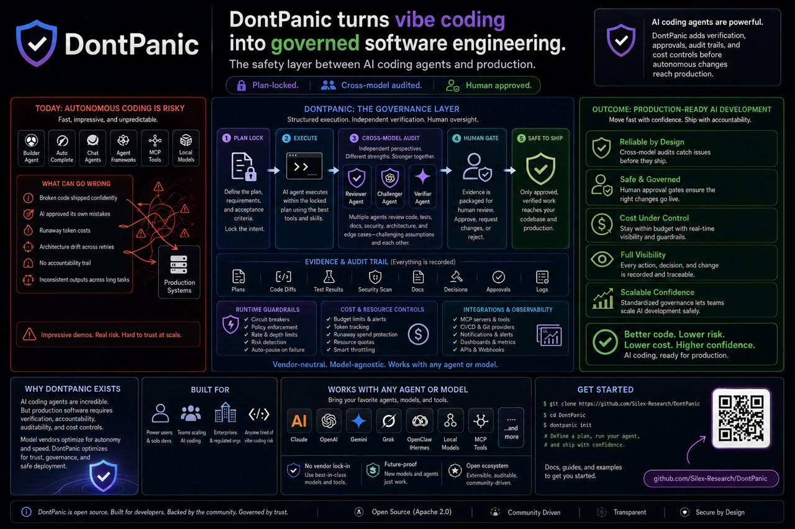

# DontPanic

> Trust infrastructure for AI coding agents.



AI agents can write real software now. The open question isn't whether they can
produce code — it's whether you should ship what they produce without looking.

DontPanic is the layer that makes that decision safe. It pins an agent's work to
a plan it can't quietly rewrite, has a **different** AI model review the result,
stops and asks a human before anything risky lands, and keeps the receipts.

Think of it as code review, CI, and an approval queue — but built for the case
where the author is an AI.

**Never let the same AI that wrote the code be the only AI that approves it.**

It works with Claude Code, Codex, Gemini, Grok, local models, OpenClaw / Hermes
workflows, and any MCP-enabled tool.

**Status:** public alpha. Ready for source installs by people comfortable with
local agent CLIs and command-line work.

## The problem

An AI coding agent is fast, confident, and tireless. It is also happy to:

- ship broken code and tell you the tests passed
- review its own work and approve it
- miss the security assumption nobody wrote down (the webhook nobody verified)
- spend $40 looping on a test that never goes green
- leave nothing behind that explains who decided what

For a prototype, none of that matters. For software other people depend on, all
of it does. DontPanic lives in the gap between two sentences:

> "The agent says it's done."

> "Should we actually merge this?"

## Why this gets harder as the work gets real

Vibe coding is great for demos and side projects. Production is a different
animal: hidden dependencies, security requirements, deploy steps, cost limits,
and a person who needs to know who approved what.

A strong engineer still gets peer review, QA, a budget, and a deploy gate — not
because they're bad at the job, but because complex systems need more than one
set of eyes. Autonomous agents are the same, only more so. The more capable the
agent, the bigger the blast radius if it's wrong and unsupervised.

Most agent harnesses chase more autonomy. DontPanic spends its effort on the
other thing: knowing you can trust the output.

## What it actually does

DontPanic wraps an agent run in the controls a senior engineer gets for free.

A plan is locked before any code is written, and its acceptance criteria become
the contract the work is graded against. If a run needs to grow that scope, it
has to say so in writing — a scope-change protocol refuses silent drift, and
every decision lands in an append-only `decisions.jsonl` ledger.

Then one model builds and a **different model family** audits: the code, the
tests, the security assumptions, the architecture, the plan itself. Different
families miss different things, which is the entire reason for using two.

Risky work stops at a human gate with the evidence attached — you approve,
request changes, or reject. And a set of circuit breakers watch for waste;
in practice you'll hit the budget and no-progress ones, and there's a global
kill-switch behind them.

Everything leaves a trail: transcripts, audit JSON, signoff, gate state, and an
`INBOX.md` log, all on disk.

A plan isn't bureaucracy here. It's the memory anchor that keeps an agent from
slowly drifting off the objective while still sounding coherent. The cross-model
audit isn't theater either: a model reviewing its own work tends to rationalize
its own mistakes, the same way you can't proofread your own typo.

## See it in action

```text
$ dontpanic dispatch-from-plan docs/plans/stripe-webhooks --confirm
✓ Plan locked: plan.md, features.json
✓ Dispatching to Claude Code (implementer)
✓ Audit assigned to Codex (auditor)
…
⚠ Gate paused: audit findings ready
  → missing webhook signature verification (security)
  → evidence packaged
  → waiting for your approval
```

Without DontPanic, that missing signature check merges fast, looks fine, and
becomes a production security bug. With it, a second model from another vendor
catches it, the run pauses, and a human signs off before the fix proceeds.

As the run goes, DontPanic writes durable artifacts under the plan directory:

| Path | What it is |
|---|---|
| `audit/<agent>-<role>-i<N>.json` | Per-iteration audit with machine-checkable verdicts |
| `audit/transcript.md` | Dispatch history: agent, role, tokens, verdict, audit link |
| `audit/signoff-<plan-id>.json` | Terminal verdict: signoff, reason, next action |
| `audit/gate-state.json` | Gate-clearance state and active breakers |
| `INBOX.md` | Append-only operator log: gate pauses, breakers, signoff |

## How it works, end to end

1. **Plan lock** — work becomes `plan.md`, `features.json`, and `decisions.jsonl`.
2. **Build** — an implementer agent executes the plan inside guardrails.
3. **Cross-model audit** — a different model family reviews the result.
4. **Human gate** — risky changes pause with evidence and a clear choice.
5. **Approve** — only approved work moves toward merge.

## Why not just Claude Code (or any single agent)?

Claude Code, Codex, Gemini, Grok, and local models make coding faster. They're
execution engines, built to generate code and finish tasks. None of them is, by
itself, a separation-of-duties system, a budget, or an audit trail.

Better prompts and skills improve *execution*. They don't create an independent
reviewer or organizational trust. In production, smarter agents need stronger
guardrails, not fewer.

This also holds for same-vendor multi-agent setups (Claude's Dynamic Workflows
or Managed Agents, and their equivalents). Those orchestrate a swarm of one
vendor's own sub-agents for speed — impressive, but they all share one model
family's blind spots, there's no independent cross-check, and the orchestrator
can improvise the plan mid-run. DontPanic takes the opposite stance: a
vendor-neutral meta-harness that sits on top of any of those engines, holds the
plan, makes a different family audit the work, keeps a human in the loop, and
trips a breaker when a run goes sideways. It can even drive the swarm as one of
its implementers.

## Who it's for

- Claude Code and Codex power users who want production-grade guardrails
- OpenClaw / Hermes operators routing work through AI agents
- teams scaling AI coding without letting one model self-approve
- anyone who's been burned by confident, wrong AI output

## What you get

DontPanic is more than a dispatch command. The current platform gives humans and
agents one shared operating surface:

| Capability | What it solves | Command surface |
|---|---|---|
| Plan lifecycle | Turns vague work into a locked, auditable contract | `dontpanic plan lock`, `plan audit`, `plan close` |
| Scope governance | Catches over-scope, weak acceptance criteria, and undeclared prereqs before a paid run; flags scope drift and cross-feature edits | `dontpanic plan-review`, `plan-review --since`, `plan lock --design-review` |
| Planning readiness | Shows which plans and features are ready, blocked, or risky to run in parallel | `dontpanic next` |
| Cross-model dispatch | Separates implementation from approval | `dontpanic dispatch-from-plan` |
| Human gates | Pauses risky work until the operator reviews evidence | `dontpanic approve`, `resume`, `ps` |
| Local dashboard | A read-only console for What Now, status, capabilities, gates, and scope. It only flags work it can prove is live; anything it can't refresh shows as "could not be refreshed" rather than as fake work | `dontpanic dashboard build`, `open`, `serve` |
| Multi-repo registry | Lets one DontPanic install manage many projects | `dontpanic projects add`, `list`, `show`, `remove` |
| Capability readiness | Shows which external integrations are ready, missing setup, or blocked | `dontpanic capabilities status`, `setup` |
| Install reconciliation | Detects stale local setup after the platform evolves | `dontpanic reconcile baseline`, `reconcile check` |
| Architecture map | Generates a visual map, keeps it current during `dashboard serve`, and detects drift after manual edits | `dontpanic architecture regen`, `status`, `diff` |
| Release-impact advisory | Warns when public docs, changelog, schemas, or onboarding may need updates | `dontpanic next`, `dontpanic plan lock` |
| Agent access | Lets Claude Code, Cursor, OpenClaw, Codex, and MCP clients call DontPanic safely | `dontpanic manifest`, `mcp serve` |
| State projection | Exposes read-only status for dashboards, agents, and adapters | `dontpanic state snapshot`, `state export-dashboard` |

The default posture is local-first and preview-before-mutation. Firebase,
Discord, Linear, OpenClaw, and Printing Press are capabilities you opt into; none
is required for core use.

## 60-second start

The command is `dontpanic`. You need Python 3.10+, git, and at least one local
agent CLI if you want to dispatch real work.

### 1. Install

```bash
git clone https://github.com/Silex-Research/DontPanic.git
cd DontPanic
python3 -m pip install -e ".[dev]"
```

Confirm the CLI is on your path:

```bash
dontpanic --version
dontpanic --help
```

### 2. Orient a new agent, then configure roles

A new agent (human or AI) starts by reading the generated operating brief: the
operator-vs-worker distinction, the role catalog, and the canonical command
flow.

```bash
dontpanic agent brief          # the onboarding brief; `dontpanic agent` alone prints it too
dontpanic agent whoami         # classify THIS agent (operator vs registered worker)
```

`dontpanic setup` is preview-only by default. It writes no secrets; it stores
agent role names and project runtime pointers only.

```bash
dontpanic setup \
  --implementer claude \
  --auditor codex \
  --goal-auditor codex
```

If the preview looks right, add `--yes`:

```bash
dontpanic setup \
  --implementer claude \
  --auditor codex \
  --goal-auditor codex \
  --yes
```

Inspect what was written:

```bash
dontpanic config show
dontpanic manifest init --yes
dontpanic manifest show --json
```

Agent CLIs authenticate themselves. DontPanic never stores API keys.

### 3. Onboard an agent and a repo

DontPanic distinguishes two roles. An **operator** is a human or interactive
agent that *runs* DontPanic — locks plans, approves gates, reads guidance. A
**worker** is an agent DontPanic *dispatches* to implement or audit (claude,
codex, and so on). A worker has to be a registered executor; an operator-only
agent can't be assigned the `implementer` or `auditor` roles.

New agent — read the brief and check readiness:

```bash
dontpanic agent brief            # human-readable operating brief
dontpanic doctor --agent         # CLI, manifest, roles, homes readiness
```

New repo — register and onboard in one step. `--onboard` writes the managed
`AGENTS.md` block so a fresh clone is agent-ready immediately:

```bash
dontpanic projects add myapp /absolute/path/to/myapp --onboard
dontpanic doctor --project myapp     # this project's onboarding, config, roles
```

Re-onboarding an already-registered repo needs the explicit overwrite flags
(`--onboard --force --yes`).

Assign roles (workers must be registered executors) and set project-scoped
runtime evidence:

```bash
cd /absolute/path/to/myapp
dontpanic project config set roles.implementer claude
dontpanic project config set roles.auditor codex
dontpanic project config set runtime_evidence.web.base_url http://localhost:3000
```

See what's configured and what still needs setup, across machine and project
scope, classed `ok` / `needs_setup` / `missing` / `human_required`:

```bash
dontpanic config inventory               # current repo / machine scope
dontpanic config inventory --project myapp
```

When an item needs a human, the response carries exactly **one** dashboard hint:
the active URL if a dashboard is running, otherwise the start command. The full
walkthrough lives in [`docs/GETTING_STARTED.md`](./docs/GETTING_STARTED.md).

### 4. Run the doctor

```bash
dontpanic doctor --skip-auth
```

For Firebase or backend projects, authenticate the relevant CLIs and run the
full doctor:

```bash
gcloud auth login
gcloud auth application-default login
firebase login
dontpanic doctor
```

### 5. Open the local dashboard

The dashboard is local-first and does not require Firebase.

```bash
dontpanic dashboard build
dontpanic dashboard open
```

For a live localhost view while you work:

```bash
dontpanic dashboard serve
```

It binds `127.0.0.1` only and runs one server per DontPanic home. A second
`serve` for the same home is refused with the URL of the one already running, so
open that instead of stacking servers. Pass `--replace` (alias `--force-single`)
to stop a stuck server and take over; a crashed server's stale record is pruned
automatically on the next `serve`. When work is blocked, `dontpanic what-now
<plan>` and `dontpanic config inventory` tell you whether a dashboard is already
running (and its URL) or print the start command.

### 6. Try a safe sample plan

This exercises the full plan lifecycle without dispatching any paid agent call.
It validates, locks, and closes an exempt infra plan.

```bash
python3 claude/shared/schemas/v1.0/validate.py examples/plans/hello-dontpanic
tmp_plan="$(mktemp -d)/hello-dontpanic"
cp -R examples/plans/hello-dontpanic "$tmp_plan"
dontpanic plan lock "$tmp_plan"
dontpanic plan close "$tmp_plan"
```

The copy keeps your checkout clean. It dispatches no agents and calls no paid
model API.

### 7. Dispatch real work

Plans live under `docs/plans/<YYYY-MM-DD-NNN-type-name>/` with `plan.md`,
`features.json`, and `decisions.jsonl`. Validate and lock before dispatch:

```bash
python3 claude/shared/schemas/v1.0/validate.py docs/plans/<plan-id>/
dontpanic plan lock docs/plans/<plan-id>/
```

Before dispatching, ask DontPanic what's actually ready:

```bash
dontpanic next
dontpanic next --format=json
```

`dontpanic next` reads plan and feature dependencies, gate state, capability
requirements, active supervisors, and release-impact signals. It dispatches
nothing. It tells you which work is ready, which is blocked, where parallel work
might collide, and which docs or changelog surfaces may need attention before
merge.

For a per-stage skill rubric and a ranked set of moves when work is blocked:

```bash
dontpanic skills recommend <plan-id>          # which skills to invoke for this stage
dontpanic what-now <plan-id> --feature F001   # ranked moves when blocked
```

`what-now` turns a blocked dispatch (quota cooldown, budget ceiling, iteration
cap, a cleared `pre_merge` signoff, a tripped breaker, a setup gap) into a short
list with an exact command where one is safe to emit. The supervised
implement-then-audit loop is `dontpanic orchestrate <plan-id>` (preview) or
`--confirm` (run); the lower-level `dispatch-from-plan` below is the same engine
with explicit per-step control.

Preview dispatch:

```bash
python3 scripts/quota_check.py
dontpanic quota-caps init
dontpanic dispatch-from-plan <plan-id>
```

`dispatch-from-plan` is strict dry-run by default. It prints the resolved plan,
feature, tier, target, implementer, auditor, gates, max iterations, and quota
readiness, then exits without running agents.

After you review the preview:

```bash
dontpanic dispatch-from-plan <plan-id> --confirm
```

Clear gates when prompted:

```bash
dontpanic ps
dontpanic approve <plan-id> <gate>
dontpanic resume <plan-id> --all
```

Close the plan after all features pass:

```bash
dontpanic plan close docs/plans/<plan-id>/
```

## Prerequisites

Required:

- **macOS** or Linux with **zsh** or **bash**
- **Python 3.10+** with `pip`
- **git**

Optional, depending on which agents and evidence surfaces you wire:

- **Claude Code / claude CLI** — a common implementer
- **Codex CLI** — a common cross-vendor auditor
- **gcloud SDK / firebase-tools** — only for Firebase-backed projects or backend evidence
- **jq** — handy for inspecting JSON evidence
- **ollama** — local OSS models for safety and embeddings
- **gemini CLI** — multimodal and long-context review
- **terminal-notifier** — desktop pings; `INBOX.md` is still the durable channel

The editable install pulls runtime Python dependencies from `pyproject.toml`.
Use the `dev` extra to run tests and formatting locally.

## Run tests

```bash
PYTHONPATH=scripts pytest scripts/dontpanic_orchestrate/tests/ -q
ruff check scripts/
ruff format --check scripts/
python3 scripts/sanitization_check.py
```

## Self-contained by default

Install DontPanic and it works on its own. The schemas it validates against are
vendored under `claude/shared/`, so no separate schema repo is needed to install
or run. External integrations are optional.

| Integration | Kind | What it adds | When you need it |
|---|---|---|---|
| OpenClaw | Runtime | Multi-channel agent UI | A chat surface in front of DontPanic-orchestrated work |
| Hermes `/goal` pattern | Conceptual | Shared workflow vocabulary | A shared mental model with other agent teams |
| Firebase dashboard adapter | Runtime | Realtime team dashboard | Multi-operator collaboration |
| Printing Press adapters | Runtime | External service evidence providers | OpenAPI-shaped service wrapping |
| agent-conventions upstream | Maintainer | Schema authoring and external validators | Building tools that validate DontPanic artifacts outside DontPanic |

Each integration is opt-in; none installs automatically. The core `dontpanic`
install includes the CLI, supervisor and dispatch, doctor/init/new, vendored
schemas, validators, MCP server, state projection, static dashboard, docs,
templates, and examples.

## Deeper architecture

DontPanic is portable trust infrastructure for bounded agent work. It routes
intent through reusable skills and learned memory, turns non-trivial work into
machine-checkable plans, runs those plans across model and vendor boundaries, and
preserves proof through audits, evidence, signoff, and protected-path checks.

The implementation has four layers, where each layer's output is the next
layer's contract:

```
Identity & governance        ← SOUL.md, AGENTS.md, USER.md
Routing & contracts          ← claude/RESOLVER.md, claude/shared/
Execution units              ← claude/skills/, docs/plans/<id>/
Multi-agent panel & bounds   ← Claude / Codex / Gemini / Grok / OSS, plus circuit breakers
```

Plans live in `docs/plans/<YYYY-MM-DD-NNN-type-name>/` with `features.json` as
machine-checkable ground truth. Different model families audit each other so no
single vendor self-approves.

The platform thesis is in [`docs/PLATFORM.md`](./docs/PLATFORM.md). The
plain-English product overview is in [`docs/PRODUCT.md`](./docs/PRODUCT.md). The
current build plan is in [`docs/ROADMAP.md`](./docs/ROADMAP.md).

## Vocabulary

See [`docs/GETTING_STARTED.md`](./docs/GETTING_STARTED.md) for a slower
walkthrough and [`docs/AGENT_QUICKSTART.md`](./docs/AGENT_QUICKSTART.md) for the
flow an AI caller should follow. If you already use Hermes-style `/goal`
workflows, DontPanic maps that pattern onto locked plans, implementer and auditor
roles, audit envelopes, and human approval gates.

---

## How agents call DontPanic

An agent should discover DontPanic the way a human does: read the machine-level
manifest, show the user the plan, then call the local tool surface. One rule
governs all of it:

**Always surface the plan to the user before calling dispatch(confirm=true). Do NOT auto-confirm.**

That rule lives in `~/.dontpanic/agent-manifest.json` and in every caller example
below. The manifest is the first thing an agent should read:

```bash
dontpanic manifest show --json
```

It returns the canonical command surface, including the local MCP server:

```json
{
  "mcp_server": {
    "command": "dontpanic",
    "args": ["mcp", "serve"]
  },
  "supported_commands": ["dispatch-from-plan", "projects", "manifest", "mcp"],
  "safety_rules": [
    "Always surface the plan to the user before calling dispatch(confirm=true). Do NOT auto-confirm."
  ]
}
```

An interactive agent that can run the CLI should start with the agent surface,
which is self-describing and needs no source-reading:

```bash
dontpanic agent brief       # generated operating brief — read this first
dontpanic agent commands    # machine command guidance as stable JSON
dontpanic agent guide       # version-matched, offline "start here" guide
dontpanic agent status      # can_operate / can_be_dispatched / can_orchestrate
```

`agent status` reports three independent capabilities. Any agent that can run the
commands can **operate** DontPanic; only agents registered as executors can be
**dispatched** as workers. If you're an unsupported agent, operate DontPanic —
don't configure yourself as a worker.

See [`docs/ECOSYSTEM.md`](./docs/ECOSYSTEM.md) for non-goals and caller patterns,
[`docs/DISCOVERABILITY.md`](./docs/DISCOVERABILITY.md) for the publish-readiness
checklist, and [`docs/AUTHORING_PLANS.md`](./docs/AUTHORING_PLANS.md) for the
plan-directory contract.

### Claude Code

Add DontPanic as a local MCP server, then ask Claude to validate or dispatch a
registered plan. Claude must show the plan and ask before passing `confirm=true`.

```json
{
  "mcpServers": {
    "dontpanic": {
      "command": "dontpanic",
      "args": ["mcp", "serve"]
    }
  }
}
```

Example tool flow:

```text
1. call dontpanic.list_projects
2. call dontpanic.validate_plan with {"plan": "2026-05-03-003-feat-agent-access-manifest-thin-mcp"}
3. show the validation result and dispatch preview to the user
4. only after approval, call dontpanic.dispatch with {"plan": "...", "confirm": true}
```

### Cursor

Use the same local MCP process in Cursor's MCP settings. Cursor owns the IDE
experience; DontPanic owns plan validation, gates, evidence, and signoff.

```json
{
  "mcpServers": {
    "dontpanic": {
      "command": "dontpanic",
      "args": ["mcp", "serve"]
    }
  }
}
```

Example tool flow:

```text
1. call dontpanic.validate_plan for the selected plan
2. call dontpanic.status to see active gates and signoff state
3. never call dontpanic.dispatch with confirm=true until the user approves
```

### OpenClaw

OpenClaw should treat DontPanic as a callable software-delivery skill, not a
runtime competitor. The OpenClaw skill reads `~/.dontpanic/agent-manifest.json`,
starts the local MCP server, and forwards plan and gate updates back to the user.

```json
{
  "mcpServers": {
    "dontpanic": {
      "command": "dontpanic",
      "args": ["mcp", "serve"]
    }
  }
}
```

Example tool flow:

```text
1. read ~/.dontpanic/agent-manifest.json or call dontpanic manifest show --json
2. call dontpanic.validate_plan for the plan OpenClaw is about to run
3. surface the plan and gates in the OpenClaw conversation
4. call dontpanic.dispatch only after explicit user approval
```

### Codex CLI

Codex can shell out to the CLI today and use the same MCP shape inside an
MCP-aware host. The cross-vendor pattern is the common one: one model implements,
another audits, and DontPanic records the evidence.

```json
{
  "mcpServers": {
    "dontpanic": {
      "command": "dontpanic",
      "args": ["mcp", "serve"]
    }
  }
}
```

Example tool flow:

```text
1. run dontpanic manifest show --json to discover the local command
2. call dontpanic.validate_plan or run dontpanic dispatch-from-plan <plan-id>
3. show the dry-run/preflight output to the user
4. dispatch only when the user authorizes confirm=true
```

---

## Project layout

```
DontPanic/
├── SOUL.md                          # values, safety guard
├── AGENTS.md                        # operating manual, role catalog
├── USER.md                          # who you're helping
├── CONTINUOUS_WORK_PROTOCOL.md      # 15-min cycle, tier-based approval matrix
├── MEMORY_ARCHITECTURE.md           # daily logs, long-term memory layout
│
├── claude/
│   ├── RESOLVER.md                  # intent → skill routing with precedence
│   ├── settings.json                # hooks, env, permissions
│   ├── skills/                      # 24 skills (plan-artifacts, brainstorm-gate, …)
│   ├── hooks/                       # session-start, security-gate, …
│   ├── commands/                    # slash commands
│   ├── registry/entities.md         # cross-project service registry
│   └── shared/                      # ← agent-conventions subtree (v1.1.0)
│       ├── conventions/             # firestore-security, error-handling, …
│       ├── resolver/SPEC.md         # RESOLVER.md format definition
│       ├── skill-standard/          # skill conformance, template
│       └── schemas/v1.0/            # plan/features/audit/signoff schemas, Pydantic
│
├── docs/plans/                      # directory plans (executable contracts)
│   └── <YYYY-MM-DD-NNN-type-name>/
│       ├── plan.md                  # frontmatter validates against plan.schema.json
│       ├── features.json            # validates against features.schema.json
│       ├── decisions.jsonl          # append-only decision log
│       ├── audit/*.json             # per-agent audit reports
│       └── evidence/                # small artifacts (large → Firebase Storage)
│
├── capabilities/                    # external capability manifests, setup/verify contracts
│   ├── agent-claude-cli.json         # agent CLI capability example
│   ├── discord-notify.json           # notification sink
│   ├── firebase-dashboard.json       # optional realtime dashboard adapter
│   └── linear.json                   # PM-tool adapter reference
│
├── examples/plans/hello-dontpanic/   # safe lifecycle sample
│
├── scripts/
│   ├── dontpanic_orchestrate/        # supervisor runtime, CLI package
│   ├── bootstrap.sh                  # optional GCP/Firebase setup
│   ├── dontpanic_doctor.py           # preflight health checks
│   ├── sanitization_check.py         # sanitization regression guard
│   └── quota_check.py                # LLM tokens → ~/.dontpanic/quota_state.json
│
├── dashboard/                       # operator-local visual console, optional Firebase adapter
│   ├── index.html                   # local dashboard shell
│   ├── pages/                       # What Now, Status, Capabilities, Mission Control, …
│   └── state/                       # generated projections: plans, gates, capabilities, costs, …
│
├── .secrets/                        # gitignored — service account keys (bootstrap --create-key)
├── environments.json                # gitignored; generated from environments.json.example
└── .firebaserc                      # gitignored; generated from .firebaserc.example
```

---

## Architecture in one diagram

```
SOUL / AGENTS / USER       ← who I am, what I can do, who I serve
        ↓
RESOLVER + claude/shared/  ← which skill fires, by which rules
        ↓
skills/ + registry/        ← unit of work, plus cross-project knowledge
        ↓
plans/ + features.json     ← executable contract for any non-trivial work
        ↓
Claude / Codex / Gemini / Grok / OSS  ← the panel that implements and audits
        ↓
CAWP tiers + quotas + dashboard       ← the throttle and the readout
```

Full design in [`docs/plans/2026-04-19-001-infra-cross-agent-orchestration/plan.md`](./docs/plans/2026-04-19-001-infra-cross-agent-orchestration/plan.md).

---

## Two-axis billing

DontPanic tracks cost on two independent axes:

| Axis | Source | Output | Use |
|---|---|---|---|
| GCP $ | Your billing-account BigQuery export | `dashboard/state/costs.json` | Cloud-spend dashboard (operator-supplied refresh script; not bundled) |
| LLM tokens | Per-model session logs (Claude, Codex, Gemini, Grok) and an Ollama probe | `~/.dontpanic/quota_state.json` | Circuit breakers defer dispatch when weekly quota nears the cap |

Run `python3 scripts/quota_check.py` for LLM tokens (every ~30 min during active
work). The GCP $ refresh is operator-specific — project list, app categorization,
and billing-export project all vary — so it isn't shipped as a bundled script.

---

## Setup checklist (running list — what new users need)

This grows as we build. When a feature needs new setup, it lands here.

First-use baseline:

- [x] Editable install from `pyproject.toml`
- [x] Top-level `dontpanic --help` and `dontpanic setup --help`
- [x] Preview-by-default setup flow
- [x] Global roles config at `~/.dontpanic/config.json`
- [x] Project config at `<repo>/.dontpanic/dontpanic.json`
- [x] Agent manifest at `~/.dontpanic/agent-manifest.json`
- [x] Safe sample plan at `examples/plans/hello-dontpanic/`

Supervisor and executor panel (shipped):

- [x] Single-agent and volley dispatch (Claude, Codex, Gemini, Grok, Ollama executors)
- [x] 8 circuit breakers (budget_ceiling, iteration_cap, no_progress, diminishing_returns, convergence_collapse, wall_clock, environmental_blocker, global_circuit_breaker)
- [x] Vendor-native quota tracker (`scripts/quota_check.py` v2 schema)
- [x] Operator caps and Claude calibration (`~/.dontpanic/quota_caps.json`, `~/.dontpanic/quota_calibration.json`)
- [x] Engagement surface (`INBOX.md`, `signoff-<plan-id>.json`, `transcript.md`, `gate-state.json`)
- [x] CLI surface: `dispatch-from-plan`, `quota-caps`, `calibrate-claude`, `approve`, `resume`, `ps`, `claude-touch`
- [x] Goal Governance V1 lock/close gates (`dontpanic plan lock`, `dontpanic plan audit`, `dontpanic plan close`)
- [x] Runtime evidence collectors for web, iOS, Android, and backend observability

Operator-local prerequisites (per machine):

- [ ] Codex / Gemini / Grok CLIs authed (only the agents your plans use)
- [ ] `terminal-notifier` installed (`brew install terminal-notifier`) for desktop pings — optional; INBOX.md is the durable channel
- [ ] `~/.dontpanic/quota_caps.json` initialized (`quota-caps init`) and Claude calibrated (`calibrate-claude --dashboard-pct N`)
- [ ] Re-calibrate Claude weekly (`quota_check.py` warns at >7 days)
- [ ] gcloud/firebase authenticated only for Firebase-backed projects or backend evidence capture
- [ ] BigQuery billing export configured (manual, Console only) — optional, only for app-level $ tracking

---

## See DontPanic on real repos

[`docs/showcase/`](./docs/showcase/README.md) holds artifacts from running
DontPanic's architecture map, strict plan validation, and drift probes against
four real checkouts we own. No DontPanic runtime code is copied into any target
repo; the showcase is the product surface.

- Visual architecture map of [`agent-conventions`](./docs/showcase/agent-conventions-architecture.html) (the shared schema repo)
- Visual architecture map of [`Glam`](./docs/showcase/glam-architecture.html) (largest target — iOS creator hub and commerce)
- DontPanic itself: [architecture](./docs/showcase/dontpanic-architecture.html), [plan validation](./docs/showcase/dontpanic-validate-plans.json), [drift](./docs/showcase/dontpanic-drift.json)

Regenerate with `make showcase` (or `scripts/showcase.sh`). Full index,
per-target regen commands, and the local-integration deferral policy:
[`docs/showcase/README.md`](./docs/showcase/README.md).

---

## Contributing

See [`CONTRIBUTING.md`](./CONTRIBUTING.md). For substantial changes, read
`AGENTS.md`, follow the conventions in `claude/shared/conventions/`, and write or
update a plan before code.

## License

Apache-2.0. See [`LICENSE`](./LICENSE).
