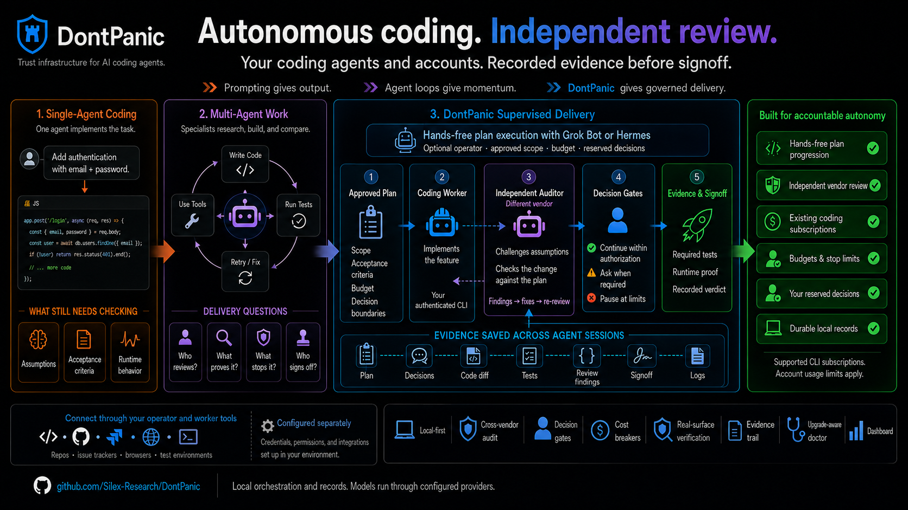

# DontPanic

> Autonomous implementation. Independent review. Evidence before signoff.

**Never let the same AI that wrote the code be the only AI that approves it.**

DontPanic turns well-developed plans into reviewed, tested software by coordinating
AI coding agents. One worker implements, a different vendor's worker audits,
and the supervisor carries findings through correction and review. Plans,
evidence, decisions, and signoff stay on disk so the work can continue across
agent sessions.

**Run it yourself, or add an operator agent for hands-free administration.**
Grok Bot, an OpenClaw or Hermes workflow, or another CLI/MCP caller can keep an
authorized plan moving through its features without you relaying messages,
restarting each pass, or chasing status. The operator is optional; DontPanic
already runs the implementation-and-review loop.

Production reliability comes from explicit acceptance criteria, independent
review, required tests and runtime proof, bounded execution, and controlled
release decisions. Those records support the decision to call the work complete.

**Status:** public alpha, single-operator. Install from source on macOS or Linux.
Team/RBAC governance is not built yet. Orchestration and receipts are local;
model calls use the providers you configure.



## How the work moves

```text
You define the outcome, plan, budget, and decision boundaries
                            |
             You OR an optional operator agent
                 (Grok Bot, OpenClaw, Hermes, ...)
                            |
                        DontPanic
              locked plan + supervised workflow
                  /                     \
         Coding worker             Independent auditor
          implements  <--- fixes --- reviews and challenges
                  \                     /
                 tests + runtime evidence + signoff
                            |
           next feature, plan close, or a human decision
```

The operator chooses and advances work. DontPanic manages dispatch, review,
gates, budgets, and the evidence trail. Workers implement or audit the selected
feature. You retain the decisions reserved for you in the approved workflow.

## Choose how to use it

### Work directly with the CLI

Preview a feature, dispatch it, inspect the findings, and approve the next step.
DontPanic hands work between the implementer and auditor. You manage the plan's
progress from the terminal or dashboard.

### Delegate administration to an operator agent

For a well-developed plan, an optional operator can manage implementation
through completion autonomously within your authorization. It selects ready
features, dispatches work, reads results, continues correction passes, gathers
proof, and performs the permitted close-out steps. It returns to you when a
reserved decision or an unresolved blocker needs attention.

**Grok Bot is one way to run this workflow; it is not a dependency.** The same
pattern works with an agent that can operate DontPanic's CLI or MCP tools and
remain available to monitor the work.

Make the plan executable before delegating it: name the outcome and acceptance
criteria, feature dependencies, intended checkout and environment, required
proof, available tools, budget, and decisions that need you. The more of this
is settled up front, the less administration returns to you during the run.

An example authorization is: “Implement this plan within its declared scope,
environment, and budget. Continue implementation, review, and verification
through the approved features. Bring scope changes, budget increases, and
production release decisions back to me.”

An operator can continue work covered by that authorization. It must honor
remaining human gates and circuit breakers; an unresolved test or missing
runtime proof stays unresolved until it is addressed.

For mobile work, execution must reach the right machine: iOS compilation and
Simulator proof require a Mac with Xcode even if the operator runs on Linux.
The operator's runtime supplies remote access, scheduling, and notifications.
See the [operator workflow](./docs/AGENT_QUICKSTART.md#autonomous-operation).

### Coordinate ML experiments

In a restaurant-revenue prediction hackathon, Rolando L Bouloy Fascitelli
reports using DontPanic to coordinate research, implementation, and validation
agents, with human decisions about which model candidates to promote. Frozen
candidates, experiment logs, and validation artifacts kept the work grounded
across agent sessions.

His [case study](https://medium.com/@rolandolbouloyfascitelli/how-playing-volleyball-with-ai-agents-helped-me-predict-restaurant-turnover-and-win-a-hackathon-a3c696d6e900)
reports rejecting gains that failed independent validation and distinguishes
the clean model's cross-validation performance from its competition-specific
leaderboard result. The ML pipeline and tuning logic belong to that project;
DontPanic supplies the workflow controls, review, and decision records.

## What DontPanic provides

| Capability | What you can rely on it to do |
| --- | --- |
| Plan contracts | Lock scope and acceptance criteria; record scope changes and decisions. |
| Independent review | Dispatch implementation and audit to different vendors; carry findings through the supervised loop. |
| Verification | Run configured checks and evaluate required outcome evidence at close; surface missing proof. |
| Execution limits | Apply quota, iteration, no-progress, and other circuit breakers; pause at configured gates. |
| Durable records | Retain transcripts, audit envelopes, signoff, gate state, and the operator log. |
| Multi-project operation | Register repos and expose readiness, work status, and next actions through CLI, MCP, and a local dashboard. |

The strength of verification depends on the plan's criteria and the proof
collected. A passing unit test does not establish that a complete user journey
works. Some experience checks still require human verification; missing proof
can block close, be flagged, or require an explicit disposition under the plan's
policy. See [plan authoring](./docs/AUTHORING_PLANS.md).

## Which agents can do what?

An **operator** calls DontPanic. A **worker** is dispatched by DontPanic.

| Harness or runtime | Operator | Dispatchable worker roles |
| --- | --- | --- |
| Claude Code | Yes | Implementer, auditor, goal auditor |
| Codex CLI | Yes | Implementer, auditor, goal auditor |
| OpenRouter | Via a caller | Auditor and goal auditor only |
| Ollama | Via a caller | Auditor and goal auditor only |
| Grok, Gemini | Yes | None (operator-only) |
| OpenClaw, Hermes, Cursor, other CLI/MCP callers | Yes | None (operator-only) |

Claude and Codex require installed, authenticated CLIs. OpenRouter requires
`OPENROUTER_API_KEY`; Ollama requires its local binary and a pulled model.
Model versions and named worker profiles are configured separately from these
harnesses. Check the installed runtime with `dontpanic agent status` and see
[the capability matrix](./docs/AGENT_CAPABILITY_MATRIX.md) for role restrictions.

## Start locally

You need Python 3.10+, git, and a POSIX shell. Agent accounts and CLIs are needed
for real dispatch, but not for the sample below.

### Install

```bash
git clone https://github.com/Silex-Research/DontPanic.git
cd DontPanic
python3 -m venv .venv
source .venv/bin/activate
python3 -m pip install -e ".[dev]"
dontpanic --version
dontpanic agent brief
dontpanic doctor --skip-auth
```

In a new shell, activate this virtual environment again. When an operator runs
from another repo, put the installed `dontpanic` executable on its PATH or use
its absolute path. Agent CLIs manage their own authentication; DontPanic config
stores role names and runtime pointers, not API keys.

### Try the plan lifecycle without a paid agent call

From the DontPanic checkout:

```bash
python3 claude/shared/schemas/v1.0/validate.py examples/plans/hello-dontpanic
sample_plan="$(mktemp -d)/hello-dontpanic"
cp -R examples/plans/hello-dontpanic "$sample_plan"
dontpanic plan lock "$sample_plan"
dontpanic plan close "$sample_plan"
```

This sample validates, locks, and closes an exempt infrastructure plan. It
checks installation and the lifecycle; it does not demonstrate implementation
or a production release. Its legacy `local` target can emit advisory warnings
while the exempt lifecycle completes.

### Configure workers and register your project

Preview the configuration, then apply it:

```bash
dontpanic setup --implementer claude --auditor codex --goal-auditor codex
dontpanic setup --implementer claude --auditor codex --goal-auditor codex --yes
dontpanic projects add myapp /absolute/path/to/myapp --onboard
dontpanic config inventory --project myapp
```

Replace `myapp` and its path with your project. Configure the project's runtime
evidence and quota readiness using the [getting-started guide](./docs/GETTING_STARTED.md).
An operator agent is optional throughout setup.

## Run a feature from an approved plan

You or your planning agent authors `docs/plans/<plan-id>/` with `plan.md`,
`features.json`, and `decisions.jsonl`. There is no `dontpanic intake` command;
plan creation belongs to you or the calling agent. Follow
[the plan-directory contract](./docs/AUTHORING_PLANS.md) before locking.

From the intended project checkout, replace the plan path and feature below:

```bash
cd /absolute/path/to/myapp
plan="docs/plans/<plan-id>"
feature="F001"
dontpanic plan lock "$plan"
dontpanic next --format=json
dontpanic dispatch-from-plan "$plan" --feature "$feature"
```

The final command previews the run. Inspect the resolved plan, feature, target,
workers, gates, and quota readiness before authorizing execution. Confirm you
are operating on the intended checkout. Then run:

```bash
dontpanic dispatch-from-plan "$plan" --feature "$feature" --confirm
```

DontPanic runs implementation and independent review, carrying findings through
correction passes until it reaches a terminal result, a gate, or a limit.
`dontpanic orchestrate` is an alternative entry point to the same dispatch
workflow. Both preview by default and run with `--confirm`.

When a gate pauses work, inspect the records and the guidance:

```bash
dontpanic ps
dontpanic what-now "$plan" --feature "$feature"
```

If the specific pending gate is approved, clear it using the gate name DontPanic
printed. When guidance calls for another run, re-dispatch the same feature:

```bash
dontpanic approve "$plan" "<pending-gate>"
dontpanic dispatch-from-plan "$plan" --feature "$feature" --confirm
```

`approve` and `resume --gate` clear a gate; neither restarts execution.
`resume --all` is explicit bulk clearance, not the normal continuation step.
If a feature already has signoff, follow its close-out guidance instead of
starting another paid pass. Close the plan after all required features and
proof are complete:

```bash
dontpanic plan close "$plan"
```

A direct operator performs these steps. An authorized operator agent can manage
them across the plan, keeping you informed and escalating the decisions you
reserved. The agent-facing rule remains:

> Always surface the plan to the user before calling dispatch(confirm=true). Do NOT auto-confirm.

Existing authorization can cover continued execution of the same bounded plan;
an agent must not invent authorization or silently expand its scope. Read the
[agent guide](./docs/AGENT_QUICKSTART.md) before wiring autonomous operation.

## Inspect the evidence

| Plan artifact | Purpose |
| --- | --- |
| `features.json` | Acceptance criteria, feature status, and evidence references |
| `audit/<agent>-<role>-i<N>.json` | Structured review findings and verdicts |
| `audit/transcript.md` | Dispatch and review history |
| `audit/signoff-<plan-id>.json` | Terminal verdict, reason, and next action |
| `audit/gate-state.json` | Gate clearance and active blockers |
| `INBOX.md` | Durable operator events and decisions |

For a live local view, run `dontpanic dashboard serve`. The dashboard binds to
`127.0.0.1`; Firebase is optional. For command guidance and integrations, start
with `dontpanic agent commands`, `dontpanic manifest show --json`, and
`dontpanic capabilities status`.

## See DontPanic on real repos

The [showcase](./docs/showcase/README.md) contains architecture maps, plan
validation, and drift artifacts from real checkouts. These demonstrate those
specific capabilities; a feature's own evidence establishes its delivery result.

## Guides and integrations

- [Getting started](./docs/GETTING_STARTED.md): installation, quotas, runtime proof, and optional integrations.
- [Agent quickstart](./docs/AGENT_QUICKSTART.md): autonomous operation and Claude Code, Cursor, OpenClaw, and Codex client recipes.
- [Configuration](./docs/CONFIGURATION.md): harnesses, models, worker profiles, notifications, and project settings.
- [`docs/ECOSYSTEM.md`](./docs/ECOSYSTEM.md): caller patterns and runtime boundaries.
- [`docs/DISCOVERABILITY.md`](./docs/DISCOVERABILITY.md): agent discovery and publishing references.
- [Platform architecture](./docs/PLATFORM.md), [product overview](./docs/PRODUCT.md), and [roadmap](./docs/ROADMAP.md).

DontPanic stores its orchestration state and receipts locally. Hosted model
providers receive the inputs sent to them, and enabled notification or storage
integrations have their own data flows. Choose those providers and integrations
for your requirements. No hosted DontPanic service is required.

## Contributing and license

See [CONTRIBUTING.md](./CONTRIBUTING.md) for the development workflow and checks.
Report security issues through [SECURITY.md](./SECURITY.md).

Licensed under [Apache-2.0](./LICENSE).
