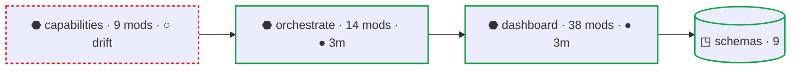

# DontPanic Operator Console — Redesign Spec

**Status:** Design proposal (v1) · **Scope:** UX + visual system for the local operating console · **Author:** design pass, June 2026

> **Thesis.** DontPanic does not have a dashboard problem. It has a *state-representation* problem. The current UI renders everything as a log — and humans do not operate systems through logs. They operate through four questions, in order: **What needs me? Why? Can I trust it? What happens if I act?** Everything else is supporting evidence.
>
> The redesign reframes the console from a *radar-packet viewer* into an **air-traffic-control tower for AI agents**. Not futuristic, not animated, not "AI-native." Calm. Serious. Operational. The current design shows the packets; this design shows the planes.

This document is the deliverable. It is, deliberately, a Markdown file in the repo — because the whole product ethos is *everything is a renderer over files*. The spec should live next to the work it governs, be diff-able, and be readable by a human or an agent. There are no pixel comps here by request; layouts are given as annotated wireframes that translate directly to DOM, and every visual element is mapped to the JSON field an agent reads.

---

## 0. How to read this spec

| Section | Deliverable it satisfies |
|---|---|
| [1. Information architecture](#1-information-architecture) | IA / nav proposal — survive / merge / regroup |
| [2. Visual system](#2-visual-system) | Type scale, color semantics, card vs row, density toggle, light + dark |
| [3. The ActionItem](#3-the-actionitem--the-atom) | The atom, rendered three ways, with parity baked in |
| [4. Scope & fleet model](#4-scope--fleet-model) | Project / fleet / global, legible at a glance |
| [5. Journey walkthroughs](#5-journey-walkthroughs) | J1 triage · J2 gate · J3 inspect-why · J4 run-in-dock · armed terminal |
| [6. State matrix](#6-state-matrix-empty--stale--loading--error) | Empty / stale / loading / error per surface |
| [7. Agent-parity table](#7-agent-parity-the-load-bearing-rule) | Every human state → the field an agent reads |
| [8. Accessibility & density](#8-accessibility--density) | A11y + the density toggle, one codebase |
| [9. Architecture surface](#9-architecture-surface--the-navigable-map) | Navigable layered map: C4-style zoom, Mermaid per level, per-node freshness |
| [10. Phasing & open questions](#10-phasing--open-questions) | Build order, schema gaps to close first |

A note on what I changed from the source brief and why is at the end of each major section, tagged **▎ Design call**.

---

## 1. Information architecture

The current nav has **8 tabs** (OPERATOR, NEEDS ATTENTION, WORK, REPAIR, ARCHITECTURE, HEALTH, TOOLS & SETUP, PREFERENCES). That structure reflects *implementation* — one tab per page module. The new structure should reflect **operator intent**, which collapses cleanly into three verbs:

```
   ACT                    UNDERSTAND               OPERATE THE ENVIRONMENT
┌──────────┐           ┌──────────┐               ┌──────────┐
│ COCKPIT  │           │   WORK   │               │  SYSTEM  │
└──────────┘           └──────────┘               └──────────┘
 what needs me           what are the              is the machine
 & let me resolve it     agents doing              itself healthy
```

### 1.1 Top navigation: three domains

```
┌───────────────────────────────────────────────────────────────────────────┐
│  DontPanic            ◐ COCKPIT    WORK    SYSTEM        ⌗ density   ◑ theme │
│                                                                             │
│  PROJECT  ▸ All Projects (Fleet) ▾        Fleet health · Good               │
│                                           14 need you · 32 running · 412 quiet│
└───────────────────────────────────────────────────────────────────────────┘
```

Scope is established **once**, in the header, and never repeated as a per-card badge in single-project view (more in §4). Humans resent being re-told what they already set.

### 1.2 What lives where

**COCKPIT** — *the action surface; the default landing page.* This is where the operator spends ~80% of their time (journeys J1–J4). It fuses three things the old design treated as separate tabs into one workflow:

- **Overview / Queue** — the triaged "what needs you," ranked, grouped by bucket (was OPERATOR).
- **Needs Attention feed** — the full relevance-ranked ActionItem list for the current scope; the substrate the queue curates (was NEEDS ATTENTION, now a sub-view, not a sibling tab).
- **Terminal dock** — the execution plane, docked to the bottom of the cockpit, always present (was a bolted-on afterthought).

Sub-nav within Cockpit: `Overview · Needs Decision · Needs Auth · Agent-Runnable · History`. The old "OPERATOR vs NEEDS ATTENTION" split was a distinction without a difference to the user — one was the curated view of the other. Merging them removes the most confusing seam in the current product.

**WORK** — *the understanding surface; human + agent.* Answers "what are the agents doing and where is it stuck."

- **Plans** — plan lifecycle (draft → approved → implementing → auditing → complete), feature pass/fail, contracts (`docs/plans/<id>/`).
- **Runs** — live orchestrations, cross-model volleys, audit verdicts, gates.
- **Architecture** — the generated system map for the selected project, as a **navigable layered map** (not a flat 149-node graph): C4-style zoom, one legible Mermaid level at a time, per-node freshness. Full treatment in [§9](#9-architecture-surface--the-navigable-map).

Architecture moves *under* WORK rather than standing alone. It is not something you act on; it is something you consult to understand activity — which is exactly WORK's job. (See **▎ Design call** below — this is the one debatable merge.)

**SYSTEM** — *the environment surface; mostly human.* Everything about the machine DontPanic runs on, not the work it governs.

- **Health** — fleet/project status rollups.
- **Capabilities** — tools & setup; what's ready / needs-setup / blocked / not-installed, global and per-project.
- **Projects** — fleet management: what's tracked, freshness, the `projects add` flow.
- **Preferences** — operator-editable config by audience / lifecycle / blast-radius.

### 1.3 The mapping, old → new

| Old tab | New home | Disposition |
|---|---|---|
| OPERATOR | Cockpit › Overview | **merged** (becomes the default) |
| NEEDS ATTENTION | Cockpit › Needs-* sub-views | **merged** (was a redundant sibling) |
| Terminal dock | Cockpit (bottom dock) | **promoted** to a permanent instrument |
| WORK | Work › Plans + Runs | **kept**, split into Plans/Runs |
| ARCHITECTURE | Work › Architecture | **moved** under Work |
| REPAIR | Cockpit (an item *resolution*) + Work › Runs | **dissolved** — see below |
| HEALTH | System › Health | **kept** |
| TOOLS & SETUP | System › Capabilities | **kept** |
| PREFERENCES | System › Preferences | **kept** |

**Repair dissolves on purpose.** "Something is broken and here is the exact remediation" *is already an ActionItem* — bucket `auto_safe` (DontPanic can fix it) or `agent_runnable`/`needs_decision` (guided fix). A separate REPAIR tab duplicates the triage queue with a different skin. Repairs should appear **in the cockpit queue** like everything else, with their remediation as the item's resolution. The fixpoint planner (multi-step repairs) becomes a resolution *type* that opens a small plan, not a destination tab. This removes a whole tab and reinforces the core model: the ActionItem is the atom; there are no parallel item systems.

> **▎ Design call — three domains, not six tabs.** An earlier cut of this proposal flattened to six tabs (Cockpit / Work / Architecture / Repair / Fleet / Setup). I'm recommending **three top-level domains with sub-nav** instead, because the brief's own hypothesis is right: Cockpit / Understand / System is the operator's mental model, and a flat six-tab bar re-introduces the "everything is equal weight" problem at the navigation level. Three domains also map exactly to the three audiences (act = human, understand = human+agent, system = human). The flat six-tab version is a valid fallback if sub-nav proves heavy to build; the table above is structured so either lands on the same destinations.
>
> **The one I'd flag for your call: Architecture under Work vs. standalone.** Architecture is "human + agent" and is consulted, not acted on, so it belongs with WORK. But it's also the answer to a *different* question ("how is this wired") than Plans/Runs ("what's happening"). If usage shows people go to Architecture cold (not from a run), promote it to a peer of Work and Cockpit. Easy to change; the content doesn't move.

---

## 2. Visual system

The current design is monospace everything at equal weight — which is, functionally, visual nihilism: a 3-decision day and a 300-item dump look identical. The fix is hierarchy, restraint, and making *trust* part of the visual grammar rather than fine print.

### 2.1 Typography — two families, strict roles

| Family | Used for | Never used for |
|---|---|---|
| **Inter** (sans) | decisions, titles, labels, summaries, body, actions | commands, paths |
| **JetBrains Mono** | commands, file paths, IDs, evidence refs, terminal, diffs | primary reading |

Monospace is *demoted from the default to a signifier*. When you see mono in this UI, it means "this is a literal machine string — a command, a path, an ID." That is itself information.

**Type scale** (1.25 ratio, rounded to even px):

```
48 / 700   Hero          the morning-triage count ("14 need you")
32 / 600   Section       domain & page headers
24 / 600   Queue count   bucket group counts
18 / 600   Item title    an ActionItem's headline
16 / 400   Body          why-now, summaries, evidence prose
14 / 500   Metadata      labels, scope, actor, timestamps
13 / 400   Mono          commands, paths, IDs (JetBrains Mono)
12 / 500   Provenance    "source · 2m ago" attribution line
```

Line-height 1.5 for body, 1.25 for headings and counts. Max reading measure ~72ch for evidence prose.

### 2.2 Color semantics — meaning, not decoration

Color is reserved for *operator-load-bearing meaning*: which bucket, how fresh, what scope, what run-state. Chrome is neutral grays. The palette is deliberately **muted and serious** (Tailwind-600-family), not neon — because the north star is *calm control room*, not glowing dashboard.

#### Action buckets (the operator's primary axis — maps to `operator_bucket`)

| Bucket | Meaning | Light | Dark | `operator_bucket` |
|---|---|---|---|---|
| **Needs Auth** | blocked on a human credential | `#DC2626` | `#F87171` | `needs_auth` |
| **Needs Decision** | blocked on human judgment | `#D97706` | `#FBBF24` | `needs_decision` |
| **Agent-Runnable** | an agent can do this now | `#2563EB` | `#60A5FA` | `agent_runnable` |
| **Auto-Safe** | DontPanic can fix it safely | `#16A34A` | `#4ADE80` | `auto_safe` |
| **Uncertain** | provenance/meaning unproven | `#7C3AED` | `#A78BFA` | `uncertain` |
| **Quiet** | true, no action needed | `#64748B` | `#94A3B8` | `quiet` |

Auth (red) outranks Decision (amber) because a missing credential *hard-blocks* — nothing proceeds until it's resolved — whereas a decision is a judgment the human can weigh. Both are "stop," but red is the harder stop.

#### Freshness — its own grammar (filled = proven, hollow = asserted)

This is the visual embodiment of *render-truth*. It must be impossible to miss.

```
●  Fresh       green     "● 3m ago"      proven live, current
●  Aging       amber     "● 3h ago"      proven, getting old
●  Stale       red       "● 2d old"      proven once, now untrustworthy
○  Unproven    hollow    "○ unverified"  asserted, never proven live
```

The rule the human learns in five seconds: **filled dot = the system proved this; hollow ring = the system is only repeating a claim.** Stale and unproven items are visibly *desaturated* (chroma dropped ~40%) so they recede until refreshed. The console never renders an unproven thing at full confidence.

#### Scope — readable without reading text (maps to `scope`)

| Scope | Hue | Light / Dark | `scope` value |
|---|---|---|---|
| **Fleet** (all projects) | Indigo | `#4F46E5` / `#818CF8` | aggregate view |
| **Project** | Teal | `#0D9488` / `#2DD4BF` | `project` |
| **Global / install** | Slate | `#475569` / `#94A3B8` | `global` |

Expressed as a 3px left border on cards plus a small chip — never as a repeated "SCOPE: PROJECT" text badge. Teal for Project is deliberate: it avoids colliding with Agent-Runnable blue.

#### Run-state (maps to `run_state`)

| State | Signal | `run_state` |
|---|---|---|
| **Idle** | no indicator | `idle` |
| **Running** | slow-pulsing blue bar / dot | `running` |
| **Waiting (human)** | steady amber | derived: `running` + `needs_decision` gate |
| **Conflicted** | red | `conflicted` |
| **Complete** | green check, then fades to quiet | derived from work state |

> **▎ Design call — muted over neon.** The source brief contained two palettes: a muted Tailwind-600 set and a neon set (`#ff3b5c`, `#00b8ff`, `#00e6a9`). I chose the **muted** one. Neon glow reads as "futuristic AI product," which directly contradicts the stated aesthetic — *calm, serious, operational*. A control tower is legible and quiet; saturated neon raises baseline arousal and defeats "calm by default." The muted palette also leaves saturated red free to mean exactly one thing: **danger** (the armed terminal, §5.5).

### 2.3 Neutrals & surfaces (light + dark)

| Token | Light | Dark | Use |
|---|---|---|---|
| `--bg` | `#FBFCFD` | `#0B0F17` | app background |
| `--surface-1` | `#FFFFFF` | `#121826` | cards, panels |
| `--surface-2` | `#F1F5F9` | `#1A2233` | hover, nested |
| `--border` | `#E2E8F0` | `#283142` | hairlines |
| `--text-1` | `#0F172A` | `#E8EDF4` | primary |
| `--text-2` | `#475569` | `#9FB0C3` | secondary |
| `--text-3` | `#94A3B8` | `#64748B` | muted / provenance |

Dark mode is the operator's default (long sessions, low ambient light); light mode is a first-class peer for daytime/handoff/screenshots. Both ship from one semantic token set — components reference `--bucket-needs-auth`, never a raw hex — so theme is a `data-theme` swap on `:root`, nothing more. The existing console already follows this pattern (semantic aliases over hues), so this is an evolution of an established convention, not a rewrite.

### 2.4 Card vs. row — same data, two densities

The atom renders as either a **comfort card** or a **dense row**. They are the *same* fields; only spacing and wrapping change (see §8 for the toggle).

```
COMFORT CARD                                   DENSE ROW
┌─┬─────────────────────────────────┐          ┌─┬──────────────────────────────────────────┐
│▌│ Security audit paused           │          │▌│ ● Security audit paused   Audit Volley · 2m│
│▌│                                 │          │▌│   Project Mercury        [Review][Approve] │
│▌│ Waiting for human gate approval │          └─┴──────────────────────────────────────────┘
│▌│                                 │           ▲ 3px scope border  ▲ freshness dot  ▲ inline actions
│▌│ ● 2m  ·  Audit Volley  ·  Mercury│
│▌│                                 │
│▌│ [Review]  [Approve]  [Changes]  │
│▌│                                 │
└─┴─────────────────────────────────┘
 ▲ scope border (teal=project)
```

Left accent bar carries scope color. The filled/hollow dot carries freshness. The bucket color tints the title and the primary action. No item ever carries a copy-command block as its *primary* face (see §3.3).

### 2.5 The "all clear" state

The payoff of the whole product. When the queue empties, the cockpit collapses to a single calm statement — not "No items" (which reads as broken):

```
                         ◔  You're clear.

              No decisions. No approvals. No blocked runs.
           412 monitored signals across 7 projects — all healthy.

                    Last full refresh · 2m ago  ●
```

Centered, generous whitespace, one quiet line of reassurance plus the proof (signal count + freshness). This is the emotional core: the operator should be able to *leave*.

---

## 3. The ActionItem — the atom

Almost everything in DontPanic reduces to one typed unit: *something is true and may need attention.* The design must make the atom's anatomy visible, because the atom is also the contract the agents read.

### 3.1 Anatomy (real `operator-triage/v0` fields)

```
ActionItem
├─ id                 stable identity              "capability:agent-claude-cli"
├─ title              human headline               "Capability agent-claude-cli needs setup"
├─ operator_bucket    the triage axis              needs_auth | needs_decision | agent_runnable
│                                                  | auto_safe | quiet | uncertain
├─ scope              global | project             ("fleet" is the aggregated view, not a value)
├─ project_name       which repo (null = global)   "mercury"
├─ run_state          idle | running | conflicted
├─ actor_label        who/what is acting           "Claude Auditor"  (nullable)
├─ why_now            plain-language consequence    "Cross-model audit disagreed…"
├─ evidence_uri       link/path to the artifact     "docs/plans/…/audit.json#17"  (nullable)
├─ exact_command      the literal next command      "dontpanic capabilities setup …"
├─ dedupe_key         fleet de-duplication key
└─ duplicate_count    how many sources asserted it  3
```

### 3.2 One model, three renderers

The same item is a CLI line, a dashboard card, and a line in an agent's brief. They must stay semantically identical — design may not invent a state that has no field.

```
CLI         dontpanic operator brief
            ! needs_decision  Security audit paused   mercury  ● 2m   → approve|changes|reject

DASHBOARD   the comfort card / dense row from §2.4

AGENT       { "operator_bucket":"needs_decision", "run_state":"running",
              "scope":"project", "project_name":"mercury",
              "why_now":"…", "evidence_uri":"…", "resolution":["approve","request_changes","reject"] }
```

### 3.3 Resolution, not homework

The biggest behavioral change: stop handing the human shell commands to paste as the *primary* interaction. The current UI reads as "here's homework." Each bucket gets a first-class affordance, with the command as the *honest fallback*, presented as a confident one-click — not a chore:

| Bucket | Primary affordance | Command's role |
|---|---|---|
| `needs_decision` | **Approve · Request changes · Reject** | shown in inspect-why, not the face |
| `needs_auth` | **Guided setup** (steps, key paste) | steps labeled, not a blind paste |
| `agent_runnable` | **Run** (in dock) / **Hand off** | one click runs `exact_command` |
| `auto_safe` | **Apply fix** (with dry-run preview) | preview is the old copy-command |
| `uncertain` | **Inspect** (prove or dismiss) | n/a — must be proven first |
| `quiet` | none — collapsed into the count | n/a |

When a raw command *is* the honest answer, it appears as a single `[Run ▸]` with the command revealed on hover/expand in mono — confident, not a wall of copy-paste cards.

---

## 4. Scope & fleet model

Project / fleet / global is conceptually rich but visually undifferentiated today. The fix: make the **whole frame** tell you your scope, so you never read a badge to know where you are.

### 4.1 Three environmental frames

```
FLEET — "All Projects"            PROJECT — "Mercury"             GLOBAL — "System"
┌════════════════════════┐       ┌────────────────────────┐      ┌▓▓▓▓▓▓▓▓▓▓▓▓▓▓▓▓▓▓▓▓▓▓▓▓┐
║ indigo header rule     ║       │ teal header rule       │      ▓ slate header rule     ▓
║ 14 need you · 7 repos  ║       │ 6 need you · Mercury   │      ▓ install-level only    ▓
║ deduped rollups        ║       │ project queue + arch   │      ▓ capabilities & tools  ▓
└════════════════════════┘       └────────────────────────┘      └▓▓▓▓▓▓▓▓▓▓▓▓▓▓▓▓▓▓▓▓▓▓▓▓┘
 a thin colored rule under the header changes with scope — peripheral, always-on signal
```

- **Fleet** is the PROJECT selector set to "All Projects." It aggregates and **de-dupes** across repos via `dedupe_key`, showing `duplicate_count` ("asserted by 3 sources") rather than three identical cards. Header rule: indigo.
- **Project** scopes the entire console to one repo. In this frame, per-card scope chips are *suppressed* (everything is Mercury; saying so on every card is noise). Header rule: teal.
- **Global** items (`scope: "global"` — the tools DontPanic itself needs) carry a slate "Install-level" chip and surface primarily in **System › Capabilities**. They appear in the fleet queue only when they block work.

### 4.2 The project selector

Top-left, always visible: a searchable dropdown. First item is **"All Projects (Fleet)"** with an indigo badge; then each tracked repo with a small icon and its own need-count. Adding a project (`dontpanic projects add <name> <path>`) auto-installs the commit hook and the repo appears here without a restart (J7) — the selector is also where "what's tracked, and is it fresh" is answered, with a freshness dot per repo.

---

## 5. Journey walkthroughs

Annotated wireframes for the core journeys. Each callout in `«…»` names the field or behavior behind the pixel.

### 5.1 J1 — Morning triage ("what needs me?")

`Cockpit › Overview`, PROJECT = All Projects (Fleet).

```
┌───────────────────────────────────────────────────────────────────────────┐
│  DontPanic     ◐ COCKPIT   WORK   SYSTEM            ⌗ density    ◑ theme     │
│  PROJECT ▸ All Projects (Fleet) ▾    ══indigo══    Fleet health · Good       │
├───────────────────────────────────────────────────────────────────────────┤
│                                                                             │
│                          313 signals                                        │
│                       182 unique findings                                   │
│                                                                             │
│                          14 need you            «count of items where       │
│                          ▔▔▔▔▔▔▔▔▔               operator_bucket ∈ action set»│
│                                                                             │
│  ▾ Needs Auth (2)        red       «operator_bucket = needs_auth»            │
│  ▾ Needs Decision (4)    amber      «operator_bucket = needs_decision»       │
│  ▸ Agent-Runnable (8)    blue       «collapsed — 8 items an agent can run»   │
│  ▸ Auto-Safe (37)        green      «collapsed — DontPanic can fix»          │
│  ▸ Quiet (412)           gray       «collapsed to a count; never a feed»     │
│                                                                             │
│   ── Needs Decision (4) ─────────────────────────────────────────────────  │
│   ┌─┬───────────────────────────────────────────────────────────────┐      │
│   │▌│ Security audit paused                     ● 2m   Audit Volley   │      │
│   │▌│ Cross-model audit disagreed with impl.    teal·Mercury          │      │
│   │▌│ [Inspect]  [Approve]  [Request changes]  [Reject]               │      │
│   └─┴───────────────────────────────────────────────────────────────┘      │
│   ┌─┬───────────────────────────────────────────────────────────────┐      │
│   │▌│ Schema change needs sign-off              ● 6m   Codex Impl    │      │
│   │▌│ …                                         teal·Mercury          │      │
│   └─┴───────────────────────────────────────────────────────────────┘      │
│                                                                             │
├───────────────────────────────────────────────────────────────────────────┤
│  ▸ Terminal dock · OFF                                            ⌃ expand   │  ← always present
└───────────────────────────────────────────────────────────────────────────┘
```

Nothing that doesn't need the operator competes for attention: `quiet` (412) and even `auto_safe` (37) are collapsed counts, not feeds. Action buckets are expanded by default; the human scans top-down by severity (auth → decision → runnable). Ranking inside a bucket is by relevance (freshness + blast-radius + duplicate_count). End state: resolve all → §2.5 "you're clear."

### 5.2 J3 — Inspect why + evidence (a right-side panel, never a modal)

Clicking **Inspect** (or a card body) slides a panel in from the right. A panel, not a modal, because operators *compare* — they keep the queue visible while reading the evidence. Five fixed sections, always in this order:

```
   Queue (still visible, dimmed)        │  INSPECT ─────────────────────────── ✕
   ┌─┬──────────────────────────┐       │
   │▌│ Security audit paused  …  │◀──────│  Security audit paused                «title»
   └─┴──────────────────────────┘       │  ──────────────────────────────────────────
   ┌─┬──────────────────────────┐       │  WHAT                                       
   │▌│ Schema change …           │       │  A security-class audit finding blocks      
   └─┴──────────────────────────┘       │  feature F014 from closing.                 
                                         │                                             
                                         │  WHY NOW                              «why_now»
                                         │  Cross-model audit disagreed with the       
                                         │  implementation on input validation.        
                                         │                                             
                                         │  EVIDENCE                          «evidence_uri»
                                         │  audit.json · finding #17     [open ▸]       
                                         │  diff: validators.py L40–58   [open ▸]       
                                         │                                             
                                         │  PROVENANCE              «actor_label, source»
                                         │  Producer · Claude Auditor                  
                                         │  Generated · 2m ago            ● verified    
                                         │  Asserted by · 1 source     «duplicate_count»
                                         │                                             
                                         │  RESOLUTION                       «resolution»
                                         │  [Approve]  [Request changes]  [Reject]      
                                         └─────────────────────────────────────────────
```

Everything required to *trust or distrust on sight*, nothing extra. The freshness dot and "verified" mark are the render-truth contract made visible: this finding was proven live 2 minutes ago.

### 5.3 J2 — Approve a gate / resume a paused volley

A gate is just a `needs_decision` item whose `run_state` is `running` (the volley is paused mid-flight). The operator never hunts for which run or file — the item carries it.

```
   RESOLUTION (in the inspect panel)
   ┌─────────────────────────────────────────────┐
   │  This will resume Volley #7 on Mercury.      │   «names the run being unblocked»
   │                                              │
   │  [ Approve ▸ ]   ← primary, bucket-amber     │
   │  [ Request changes ]   [ Reject ]            │
   └─────────────────────────────────────────────┘
            │  one confirmation
            ▼
   ┌─────────────────────────────────────────────┐
   │  ✓ Approved. Volley #7 resuming…             │   item leaves the queue;
   │     run_state → running                      │   re-renders in WORK › Runs
   └─────────────────────────────────────────────┘
```

One confirmation, no second-guessing dialog stack. On approve, the item is removed from the queue and the volley continues; the human can watch it in **Work › Runs**. Notifications surface a gate when the operator isn't looking at the cockpit.

### 5.4 J4 — Run an agent from the GUI (the dock as cockpit instrument)

The dock expands to a **side-by-side split** — queue left, terminal right — not a stacked drawer, because the whole point is *supervision*: drive the agent and watch the queue update in the same glance.

```
┌───────────────────────────────── COCKPIT ──────────────────────────────────┐
│  Needs Decision (3)            │  TERMINAL · Mercury           ● session ▕  │
│  ┌─┬────────────────────────┐  │  ────────────────────────────────────────  │
│  │▌│ Security audit paused  │  │  $ codex                                   │
│  └─┴────────────────────────┘  │  ▸ implementing F015 input-validation…     │
│  ┌─┬────────────────────────┐  │  ▸ edits: validators.py, tests/…           │
│  │▌│ Schema change …        │  │  ▸ running tests… 14 passed                │
│  └─┴────────────────────────┘  │  ▸ commit a1b2c3 — architecture map regen  │
│                                │  _                                          │
│  ↑ queue updates live as the   │                                            │
│    run produces new items      │  «stdout == dontpanic orchestrate stdout;  │
│                                │   commit triggers arch-map regen on hook»  │
├────────────────────────────────┴───────────────────────────────────────────┤
│  ▾ Terminal dock · session active · Mercury                       ⌄ collapse │
└─────────────────────────────────────────────────────────────────────────────┘
```

The operator types `codex` (or `claude`/`grok`/`gemini`/local), drives a change, and the action items + architecture map update live above and in WORK. Queue and execution plane are one workspace — the Cursor-on-top-of-governance model.

### 5.5 The armed-terminal state (the trust boundary)

The dock is a **real, unrestricted local shell, OFF by default.** When armed, the UI must *shout* it — this is the one place saturated red is reserved for. Never cute, never pretty.

```
OFF (default)                          ARMED (session active)
┌──────────────────────────────┐       ┌▙▟▙▟▙▟▙▟▙▟▙▟▙▟▙▟▙▟▙▟▙▟▙▟▙▟▙▟▙▟┐
│ ▸ Terminal dock · OFF         │       ▌  ⚠  UNRESTRICTED LOCAL SHELL   ▐
│   [ Arm terminal ]            │       ▌                               ▐
└──────────────────────────────┘       ▌  Project · Mercury            ▐
                                        ▌  Commands execute on YOUR     ▐
   arming requires explicit            ▌  machine. No sandbox.         ▐
   confirm + shows scope               ▌                               ▐
                                        ▌  ● session active   [Disarm]  ▐
                                        └▛▜▛▜▛▜▛▜▛▜▛▜▛▜▛▜▛▜▛▜▛▜▛▜▛▜▛▜▛▜┘
                                          red hazard frame, persistent,
                                          not dismissible while armed
```

The hazard frame stays visible the entire time the shell is armed — it does not fade or collapse. Disarm is always one click. The header rule and the dock both carry the red while armed, so the operator can never lose track of the fact that a live shell is open.

---

## 6. State matrix (empty / stale / loading / error)

The current design fails hardest exactly here. Every surface must define all four. The governing rule: **never imply confidence you can't prove** (render-truth), and **never let an empty result read as a broken page.**

| Surface | Empty | Stale | Loading | Error |
|---|---|---|---|---|
| **Cockpit queue** | "You're clear" payoff (§2.5) + signal count + freshness | top banner: "State may be outdated · refreshed 37m ago · regenerating" + items desaturated | skeleton rows (bucket headers + 3 ghost cards), not a spinner | "Couldn't read triage state" + last-good timestamp + `[retry]` |
| **Inspect panel** | n/a (only opens on an item) | evidence link shown with hollow `○ unverified` dot | section skeletons in order | "Evidence artifact missing" + the `evidence_uri` path so it's still actionable |
| **Work › Runs** | "No active runs · last completed Volley #6, 1h ago" | paused/idle runs marked; live ones re-poll | lane skeletons | "Orchestration state unreadable" + path |
| **Architecture** | "No map yet · self-heals on next build" (no chore command) | "Generated 2d ago · commit drift detected" badge, map dimmed | lane skeleton (Plans→…→Evidence) | "Map generation failed" + the build log link |
| **System › Capabilities** | "All capabilities ready" | "Snapshot 1h old" | tile skeletons | per-tile "probe failed," not whole-page |
| **System › Health** | "All projects healthy" | rollup timestamp shown | sparkline skeletons | "Health rollup stale" |

Principles that make this work:

- **Skeletons, not spinners.** Show the *shape* of what's arriving. Humans tolerate waiting far better when the layout is predictable.
- **Stale is visible, never hidden.** A persistent banner + desaturation. The console would rather admit "this is 37m old" than render it as fresh.
- **Empty is the payoff, not an error.** Especially the cockpit: emptiness is the product working.
- **Self-healing surfaces don't hand out chores.** Architecture regenerates on build, so its empty state surfaces the *fact* ("self-heals on next build"), not a "run this command" instruction (J6).

---

## 7. Agent parity — the load-bearing rule

The single most important constraint: **every visual object maps directly to an ActionItem field.** No UI-only concepts, no UI-only statuses. If a human sees it, an agent can serialize it. The human's dashboard and the agent's brief are two renderers over one truth; they must never disagree.

| Human-visible element | Underlying field (`operator-triage/v0`) |
|---|---|
| Bucket group + accent color + label | `operator_bucket` ∈ `needs_auth · needs_decision · agent_runnable · auto_safe · quiet · uncertain` |
| Item title | `title` |
| Why-now prose (inspect) | `why_now` |
| Scope frame / chip / left border | `scope` (`global` \| `project`) + `project_name` |
| Fleet rollup & "asserted by N" | `dedupe_key` + `duplicate_count` |
| Run-state indicator | `run_state` ∈ `idle · running · conflicted` |
| Provenance "Producer ·" line | `actor_label` |
| Evidence links / diffs | `evidence_uri` |
| Primary action (Run / fallback command) | `exact_command` |
| Resolution buttons (approve/changes/reject/run/apply) | `resolution` ⟵ **see gap below** |
| Freshness dot (fresh/aging/stale) + "verified" | **see gap below** |

**Schema gaps to close before/with the redesign** (render-truth requires the field to exist — you cannot honestly render trust you don't store):

1. **`resolution`** — the inspect panel and gate buttons need an explicit, enumerated `resolution` array per item (e.g. `["approve","request_changes","reject"]` or `["run"]` or `["apply_fix"]`). Today resolution is implied by `exact_command` + bucket; make it a first-class field so the human's buttons and the agent's options are the *same list*.
2. **`asserted_at` + `proven_live` (or `freshness`)** — the freshness grammar (filled vs. hollow dot, desaturation) needs a per-item timestamp and a boolean/enum for "proven live vs. merely asserted." Some state files carry a file-level `captured_at`; promote freshness to the item so a stale item can be demoted individually, and so the agent brief carries the same trust signal the human sees.
3. **`provenance.source` / producer id** — `actor_label` covers the display name; add a stable producer id so provenance is machine-joinable, not just a label.

These three additions are what let the design keep its promise: *trust is visible because trust is stored.* Until they land, freshness/resolution render in a **degraded-but-honest** mode (hollow `○ unverified`, command-as-fallback) rather than faking confidence.

---

## 8. Accessibility & density

**One codebase, two densities.** Power operators want air-traffic density; newcomers want air. A single toggle (`⌗` in the header) swaps `data-density="comfort|dense"` on `:root`. Comfort = cards (§2.4 left); Dense = table rows (§2.4 right). **Same fields, same DOM semantics** — only spacing, wrapping, and whether secondary metadata is inline vs. stacked. No second template, no divergent data.

**Color is never the only channel.** Every bucket carries a text label *and* a position (group order), not just a hue — so the six buckets are distinguishable for color-vision deficiency. Freshness pairs the dot with a timestamp string. Run-state pairs color with motion (pulse) *and* a label. Target contrast: WCAG AA (4.5:1 text, 3:1 UI) in both themes; the muted palette was checked toward this and the dark-mode bucket hues are lightened specifically to clear AA on dark surfaces.

**Keyboard & motion.** Full keyboard path for the core loop: `j/k` move in queue, `Enter` inspect, `a/c/r` approve/changes/reject, `/` focus project search, `` ` `` toggle dock. The running-pulse and any transitions respect `prefers-reduced-motion` (pulse → static ring). The inspect panel is a focus-trapped region with a visible focus ring (the console already defines `--focus-ring`).

**Local-first / offline.** Everything above works with zero network: the UI reads generated JSON from disk, themes and density are CSS-only, and "stale" is the honest fallback when the projection hasn't been rebuilt. No surface assumes cloud, auth, or connectivity.

---

## 9. Architecture surface — the navigable map

The current architecture view fails for one concrete reason: it renders **all 149 modules in a single 208 KB HTML force-directed graph** — and the snapshot is already `truncated: true` because the flat dump no longer fits. A flat graph of 149 nodes is spaghetti no human can parse; it answers neither "how is this wired" nor "can I trust this map." The fix is not a prettier graph engine. It is **hierarchy + render target**: never draw the whole thing; draw one small, legible level at a time, and let the operator *descend*.

The good news: the generated `architecture-snapshot` (`docs/architecture/architecture.json`) already carries every field this needs.

### 9.1 The levels (C4-style zoom, generated from the snapshot)

The operator navigates a hierarchy, not a plane. Each level is its own small diagram (≤ ~25 nodes), generated on demand from a slice of the snapshot. You descend by clicking a node; you ascend by breadcrumb.

```
L0  CONTEXT      the project as one node + its plans, agents, external surfaces
      │  click into the system
L1  LANES        Plans → Features → Modules(packages) → Schemas → Evidence   ← default landing
      │  click a lane / a package cluster
L2  CLUSTERS     ~12 packages (grouped by path prefix) + edges = aggregated imports
      │  click a cluster
L3  SUBGRAPH     the modules inside one package + their real import edges
      │  click a module
L4  MODULE CARD  path · summary · public_symbols · imports in/out ·
                 plans/features touching it · its schema · evidence · per-file freshness
```

The level model maps directly to snapshot fields:

| Level | Built from | Node count (today) |
|---|---|---|
| L0 Context | `plans[]`, project meta | ~5 |
| L1 Lanes | the five doc lanes | 5 lanes |
| L2 Clusters | `modules[].path` prefix → package | ~12 clusters |
| L3 Subgraph | `modules[]` + `imports[]` within one cluster | 5–25 |
| L4 Module | one `modules[]` entry + cross-joins | 1 |

Grouping 149 modules into ~12 path-derived clusters is what makes every level legible *and* dissolves the truncation problem — you never serialize the whole graph, only the slice on screen.

### 9.2 Render target: Mermaid, per level (and why that's the right call, not just convenient)

Render each level as **Mermaid**, generated deterministically from the JSON slice and written to disk (`docs/architecture/levels/<level>.mmd` next to the snapshot). This is the correct choice on the project's own terms:

- **It fits "everything is a renderer over files."** A `.mmd` is diff-able text, not an opaque canvas. The map becomes reviewable in a PR like any other artifact.
- **Agent parity for free.** The same `.mmd` + JSON slice the human sees is what an agent reads; the architecture map stays a shared truth, not a UI-only picture. An agent regenerates it on commit (the hook already exists).
- **It self-heals on build** — same pipeline that produces the snapshot.
- **Mermaid's weakness becomes a non-issue.** Mermaid degrades past ~30–40 nodes; the layered model guarantees every diagram is small, so Mermaid is always operating in its sweet spot. *Layering is what makes Mermaid viable; Mermaid is what keeps each layer clean and professional.*

For clusters that still exceed ~30 nodes, generate with the **ELK layout** (`%%{init: {"flowchart":{"defaultRenderer":"elk"}}}%%`) for orthogonal, "professional" routing rather than spring chaos.

### 9.3 Render-truth, per node (the differentiator)

This is what no force-directed graph gives you. `source_fingerprint.file_hashes` + `computed_at` let the build diff each module's current file hash against the snapshot. Every node therefore carries individual freshness — and the map can show **exactly which parts drifted** since it was generated:



Solid green border = file hash matches the snapshot (proven current). Dashed red = the file changed since generation (drift / stale) — the operator sees *where* the map can't be trusted, instead of trusting a uniformly confident-looking diagram. The whole-map freshness badge (top-right: `Generated 11m ago · commit a1b2c3 · 2 clusters drifted`) is the rollup of these.

### 9.4 The surface (Work › Architecture)

```
┌───────────────────────────────────────────────────────────────────────────┐
│  System ▸ Orchestration ▸ dontpanic_orchestrate        ← breadcrumb = level │
│                                          Generated 11m ago · a1b2c3 · ● 1 drift│
├──────────────┬────────────────────────────────────────────────────────────┤
│ LANES        │                                                             │
│ ◉ Modules    │        [ Mermaid diagram for the current level ]            │
│ ○ Plans      │        nodes colored by freshness; click a node ▸ descend  │
│ ○ Schemas    │        breadcrumb ▸ ascend ;  Esc ▸ up one level           │
│ ○ Evidence   │                                                             │
│              │                                                             │
│ filter ▸     │                                                             │
└──────────────┴────────────────────────────────────────────────────────────┘
   left rail = lane filter            center = one legible level, never 149 nodes
```

Crucially, the map is **not a dead diagram**. Because nodes cross-join to `plans`/`features.json`/`evidence`, selecting a module (L4) shows "F014 is implementing here · audit pending" with a jump into **Work › Runs** — and an item in the cockpit queue can deep-link *into* the map at the exact node it concerns. Architecture becomes the spatial index of the work, closing the loop with the rest of the console (this is the "evidence lanes" idea, realized).

### 9.5 Empty / stale / self-heal

Per §6: an absent map shows "No map yet · self-heals on next build" — never a chore command (J6). A drifted map renders dimmed with the per-node dashed-red borders and a "regenerating" affordance, rather than silently presenting stale structure as current.

> **▎ Design call — Mermaid-first, ELK for the dense levels, no force-directed anywhere.** Force-directed layouts are abandoned entirely: they're non-deterministic (the diagram moves between builds, defeating diff-ability) and illegible past ~50 nodes. Deterministic, text-sourced, per-level diagrams are slower to feel "impressive" on first load and far better to actually operate against — which is the whole thesis. If a single cluster is genuinely too dense even for ELK, that's a signal about *the code*, not the diagram, and the map surfacing it is a feature.

---

## 10. Phasing & open questions

**Suggested build order** (each phase shippable, each reinforces the model):

1. **Visual system + tokens** — Inter/JetBrains, the semantic color tokens (buckets/freshness/scope/run-state), light+dark, density toggle. Pure CSS over the existing structure; immediate calm.
2. **The atom, re-rendered** — comfort card + dense row + the "you're clear" empty state. Replace copy-command-as-primary with resolution affordances (needs schema gap #1).
3. **Cockpit merge** — fold NEEDS ATTENTION into Cockpit sub-views; dock the terminal; build the inspect-why panel (J1, J3).
4. **Gate + dock** — resolution/approve flow (J2) and the side-by-side armed terminal (J4, §5.5).
5. **Domain regroup** — collapse the 8 tabs into Cockpit/Work/System; dissolve Repair into the queue; move Architecture under Work.
6. **Freshness everywhere** — once schema gaps #2/#3 land, turn on the filled/hollow grammar and desaturation across all surfaces.
7. **Navigable architecture (§9)** — replace the 208 KB flat graph: emit per-level Mermaid slices (`docs/architecture/levels/*.mmd`) from the snapshot, wire breadcrumb zoom, and color nodes by per-file freshness from `source_fingerprint`. Can start in parallel with phase 1 (it's its own surface) but its drift coloring depends on the freshness work in phase 6.

**Open questions for you:**

- **Architecture placement** — under Work, or a peer? (§1.3 design call). Resolve with usage.
- **Notifications** — out of scope here; J2 implies a gate-notification when the operator isn't on the cockpit. Native OS notification vs. in-app only?
- **History depth** — Cockpit › History: how far back, and is it per-project or fleet-wide by default?
- **The three schema additions** (§7) are the critical path for render-truth. Worth confirming they're acceptable to add to `operator-triage/v0` (or a `/v1`) before phase 2.

---

### The transformation, in one line

Today the console says *"here's everything that happened."* The redesign makes it say: **"Here are the 14 things that matter, here's why, here's how much to trust them, here's the exact action — and everything else is under control."** That is the difference between a log viewer and an operating console. DontPanic is closer to a control tower than a developer dashboard; this design shows the planes, not the radar packets.
